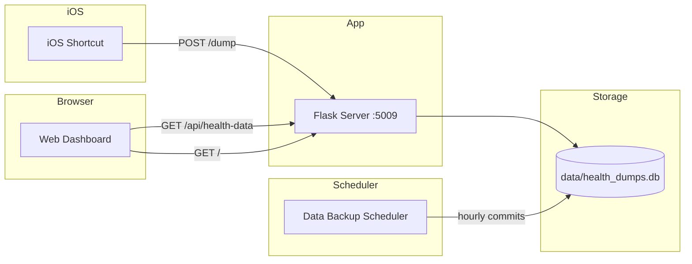

# iOS Health Dump

[](https://github.com/momonala/ios-health/actions/workflows/ci.yml)
[](https://codecov.io/gh/momonala/ios-health)

Backend service and web dashboard for receiving, storing, and visualizing daily health metrics (steps, calories, distance, flights climbed, weight) from iOS via Shortcuts.

## Architecture



## Prerequisites

- Python 3.12+
- [uv](https://github.com/astral-sh/uv) for dependency management

## Installation

1. Clone the repository:
```bash
git clone https://github.com/momonala/ios-health.git
cd ios-health
```

2. Install dependencies:
```bash
uv sync
```

## Running

```bash
uv run app
```

Open http://localhost:5009 in your browser to view the dashboard.

## Environment Variables

For Telegram summary notifications, create a local `.env` file (do not commit it) using `.env.example` as a template:

```bash
cp .env.example .env
```

Required values:
- `TELEGRAM_TOKEN`
- `TELEGRAM_CHAT_ID`

### Data Backup Scheduler

Run the scheduler to auto-commit database changes hourly:
```bash
uv run python -m src.data_backup_scheduler
```

The scheduler checks for database changes every hour and commits them to git. If a commit already exists for the current day, it will amend that commit instead of creating a new one, keeping the git history clean with one commit per day.


## Project Structure

```
ios-health/
├── src/
│   ├── app.py                    # Flask application & routes
│   ├── datamodels.py             # HealthDump dataclass
│   ├── db.py                     # SQLite connection utilities
│   ├── ios_health_dump.py        # Health dump upsert logic
│   └── data_backup_scheduler.py  # Auto-commits DB changes hourly
│
├── tests/                        # Test suite
│   ├── test_app.py
│   ├── test_datamodels.py
│   ├── test_db.py
│   └── test_ios_health_dump.py
│
├── templates/
│   └── index.html            # Dashboard HTML template
│
├── static/
│   ├── css/
│   │   └── styles.css        # Dashboard styles
│   └── js/
│       └── dashboard.js      # Dashboard logic & Chart.js integration
│
├── tmp/
│   └── import_csv.py         # CSV import script for HealthAutoExport files
│
├── data/
│   └── health_dumps.db       # SQLite database (generated)
│
├── install/
│   ├── install.sh                                      # Setup script for Raspberry Pi
│   ├── projects_ios-health.service                # Systemd service for Flask
│   └── projects_ios-health-data-backup-scheduler.service  # Systemd service for scheduler
│
├── data/
│   └── health_dumps.db       # SQLite database (generated)
└── pyproject.toml            # Dependencies & tool config
```

## API Endpoints

| Endpoint | Method | Description |
|----------|--------|-------------|
| `/` | GET | Web dashboard (HTML) |
| `/status` | GET | Health check |
| `/api/health-data` | GET | Get health data with optional date filtering |
| `/dump` | POST | Save health data from iOS |

### GET /api/health-data

Returns health data sorted by date (most recent first) with optional date filtering.

**Query Parameters:**
- `date` (optional): Filter by specific date. Accepts:
  - `today` - Returns today's data only
  - `YYYY-MM-DD` - Returns data for specific date
- `date_start` (optional): Start date for range filter (YYYY-MM-DD, inclusive)
- `date_end` (optional): End date for range filter (YYYY-MM-DD, inclusive)

**Examples:**

```bash
# Get all data
GET /api/health-data

# Get today's data only (optimized - single row query)
GET /api/health-data?date=today

# Get specific date
GET /api/health-data?date=2026-01-03

# Get date range
GET /api/health-data?date_start=2026-01-01&date_end=2026-01-31
```

**Response:**
```json
{
  "data": [
    {
      "date": "2026-01-03",
      "steps": 10000,
      "kcals": 500.5,
      "km": 8.2,
      "flights_climbed": 50,
      "weight": 72.5,
      "recorded_at": "2026-01-03T14:30:00+01:00"
    }
  ]
}
```

**Note:** Date filtering is performed at the SQL level for optimal performance.

### POST /dump

```bash
curl -X POST http://localhost:5009/dump \
  -H "Content-Type: application/json" \
  -d '{"date": "1. Feb 2026 at 13:49", "steps": 10000, "kcals": 500.5, "km": 8.2, "flights_climbed": 50, "weight": 72.5}'
```

Request body: `date` (required) format `d. Mon YYYY at HH:MM`; stored as ISO.
```json
{
  "date": "string (required, e.g. '1. Feb 2026 at 13:49')",
  "steps": "integer (required)",
  "kcals": "float (required)",
  "km": "float (required)",
  "flights_climbed": "integer (optional)",
  "weight": "float (optional)"
}
```

Response:
```json
{
  "status": "success",
  "data": {
    "date": "2026-01-03",
    "steps": 10000,
    "kcals": 500.5,
    "km": 8.2,
    "flights_climbed": 50,
    "weight": 72.5,
    "recorded_at": "2026-01-03T14:30:00+01:00"
  },
  "row_count": 42
}
```


## Data Models

```
HealthDump
├── date: str (YYYY-MM-DD, primary key)
├── steps: int
├── kcals: float
├── km: float
├── flights_climbed: int
├── weight: float | None
└── recorded_at: datetime (ISO timestamp)
```

## Storage

| File | Purpose |
|------|---------|
| `data/health_dumps.db` | SQLite DB for daily health metrics |
| `data/health_dumps.db.bk` | Backup created on each commit |

## Deployment

The `install/` folder contains scripts for deploying to a Raspberry Pi with systemd and Cloudflared:

```bash
cd install
./install.sh
```

This will:
1. Install uv and project dependencies
2. Set up systemd services for Flask and the scheduler (both enabled and started)
3. Configure Cloudflared tunnel for `ios-health.mnalavadi.org`

The scheduler service runs as a long-running process (`Type=simple`) that checks for database changes hourly and commits them to git, amending same-day commits when applicable.
